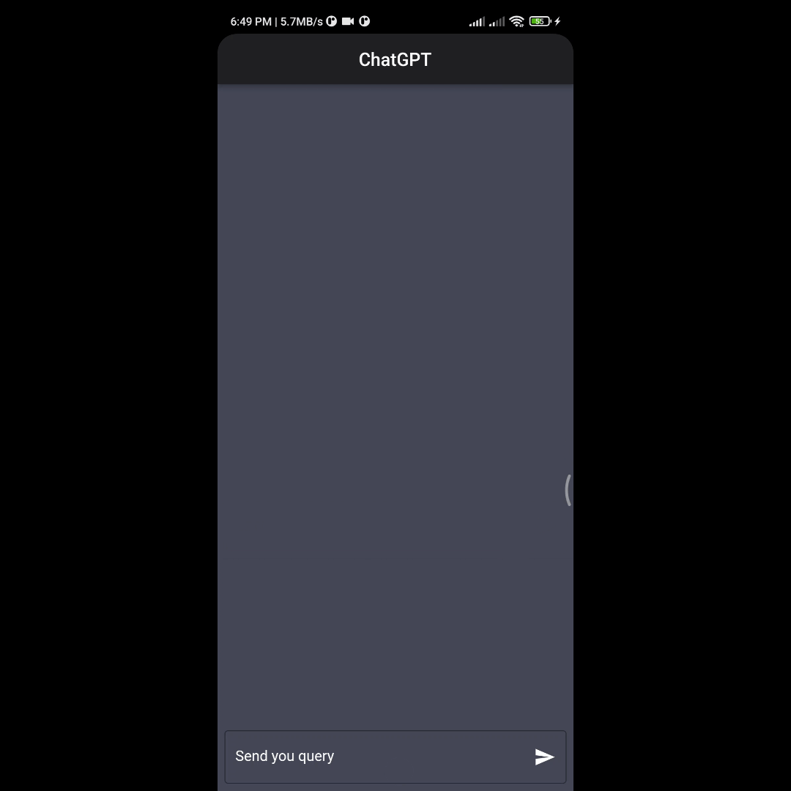

# ChatGPT

ChatGPT is a chat application built with Flutter and powered by OpenAI's GPT-3.5-turbo API.

## Usage

1. Type your query in the text field provided
2. Press the send button or tap the text field to send
3. Wait for the bot to respond

## Live Preview Click Below gif
[](https://alihamza777.github.io/chatgpt)

## Installation

Clone the repository and run the application using flutter run.

<pre>git clone https://github.com/hamzaawan007/chatgpt.git</pre>
 
Install required dependencies
- http

<pre>flutter pub get</pre>


Start the app

<pre>flutter run</pre>

## Getting Started

To start using ChatGPT, you need an OpenAI API key. Set your API key in the const.dart file.

```dart
const apikey = 'YOUR_API_KEY_HERE';
```

You can get an API key for [OpenAI's GPT-3](https://openai.com/)

## License

This project is licensed under the MIT License - see the LICENSE file for details.
